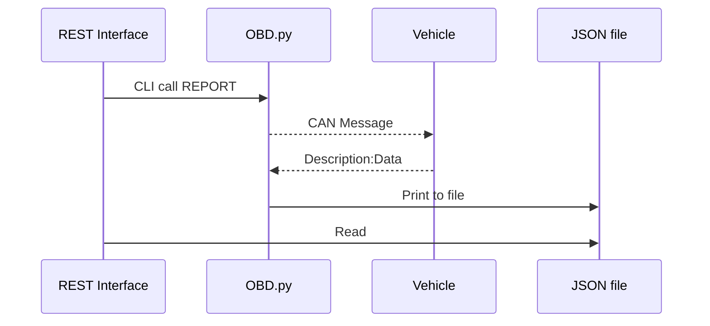

# OBDII-Interface

OBD.py is the main program used to obtain the OBD2 diagnostic information [See OBD.py below]
**You must be running Python3 for the program to work**
All diagnostic information is sent through the `export_data.json` for OBD2 and `log.txt` for specific program debug information of the normally printed messages in console. 

> All Debuggy information is accessed through the `export_data.json` and
> should not be modified.

# Installation and Usage

    usage: OBD.py [-h] [-g] [-c] [-r] [-d]
    
    OBD2 Program
    
    optional arguments:
      -h, --help    show this help message and exit
      -g, --get     Get the current Diagnostic Troubleshooting Codes (DTCs) from the vehicle
      -c, --clear   Clear the current DTCs from the vehicle
      -r, --report  Read current sensor values
      -d, --debug   Print debug information to terminal

Upon first launch the CAN bus will automatically be setup using SocketCAN assuming the correct hardware is used

## Required Packages:

    certifi==2020.6.20
    chardet==4.0.0
    colorzero==1.1
    dbus-python==1.2.16
    distro==1.5.0
    distro-info==1.0
    gpiozero==1.6.2
    greenlet==0.4.17
    gyp==0.1
    idna==2.10
    msgpack==1.0.0
    packaging==21.3
    picamera2==0.3.6
    pidng==4.0.9
    piexif==1.1.3
    Pillow==8.1.2
    Pint==0.7.2
    pycurl==7.43.0.6
    PyGObject==3.38.0
    pynvim==0.4.2
    pyparsing==3.0.9
    pyserial==3.5
    python-apt==2.2.1
    python-can==4.1.0
    python-prctl==1.7
    requests==2.25.1
    RPi.GPIO==0.7.0
    simplejpeg==1.6.4
    six==1.16.0
    speedtest-cli==2.1.3
    spidev==3.5
    ssh-import-id==5.10
    toml==0.10.1
    typing-extensions==4.4.0
    unattended-upgrades==0.1
    urllib3==1.26.5
    v4l2-python3==0.3.1

## To Run

    python3 OBD.py [-h] [-g] [-c] [-r] [-d]

## UML diagram
Example sequence of OBD.py returning the current sensor data

# Hardware
Pi-CAN2: https://copperhilltech.com/pican2-controller-area-network-can-interface-for-raspberry-pi/
Raspberry Pi-4
